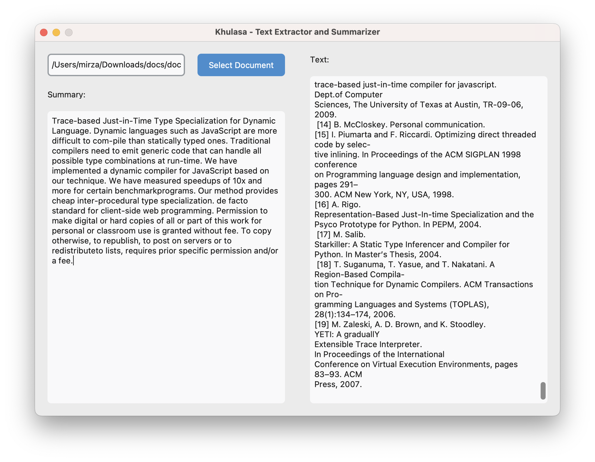

# Khulasa: Your Ultimate Text Summarization and Extraction Tool



Khulasa simplifies text summarization and extraction for students, teachers and researchers alike. It works with both `DOCX` and `PDF` file format.

## Demo Video
[](https://www.youtube.com/watch?v=cRC9smO4pAg)

## Getting Started

Ready to join the Khulasa? Here's how:

1. **Clone the Repository:**

   ```bash
   git clone https://github.com/your-username/khulasa.git
   ```

2. **Install Dependencies:**

   ```bash
   pip install -r requirements.txt
   ```

3. **Launch Khulasa:**

   ```bash
   python main.py
   ```

4. **Enjoy Summarizing!** Thats it select a document and you are ready to go.

## Contributing

We love open source, and we'd be thrilled to have you contribute to Khulasa! Check out our [Contribution Guidelines](CONTRIBUTING.md) to get started.

## License

This project is licensed under the MIT License - see the [LICENSE](LICENSE) file for details.

## Contact Us

Have questions or feedback? Join the conversation in our [GitHub Discussions](https://github.com/bilalmughal/khulasa/discussions) or reach out to us via email at [bilalmughal@gmail.com](mailto:bilalmughal@gmail.com).
